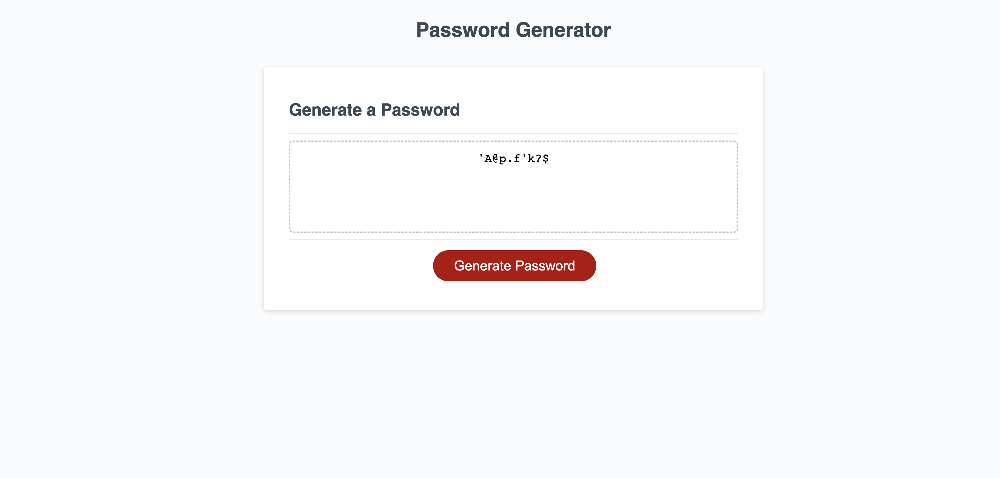

# Password-Challenge
## Description
#
The site is meant to create a random password for the user. 

## Installation 
#
The web page was installed through pushing local html, css, and javaScript into github.

## Usage
#
If the user picks the correct criteria from each prompt, the site will generate a random password according to that data.
## Credits
#
Credit goes to the staff for providing us with the full html and css. It was helpful to have a little bit of starter code in the javaScript as well. 

## License
#
N/A
## Deployment Link 
#
(https://bignate38.github.io/Password-Challenge/)

